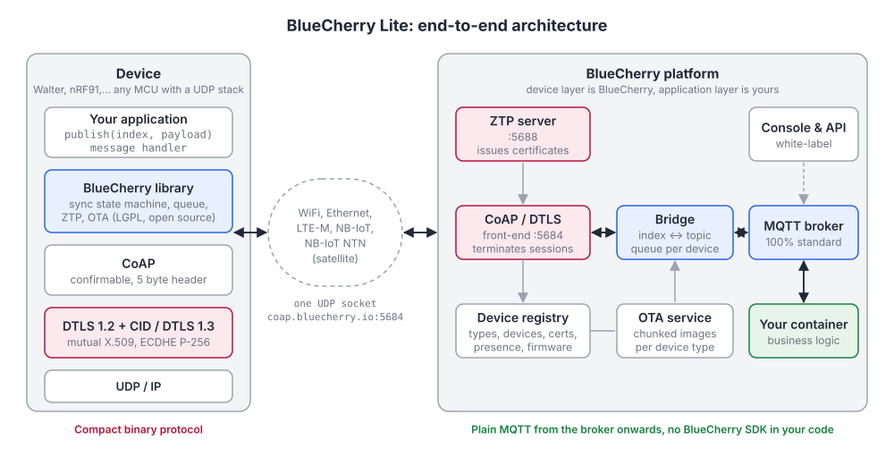
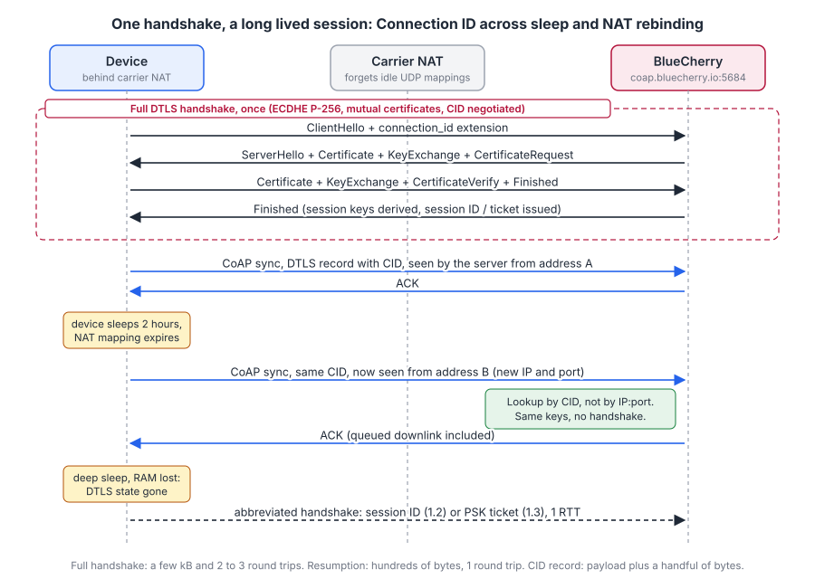
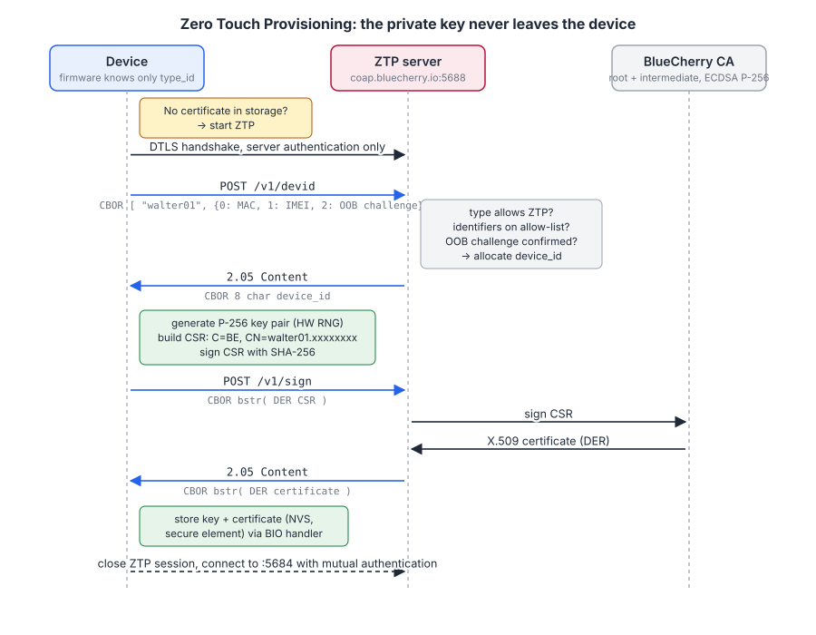
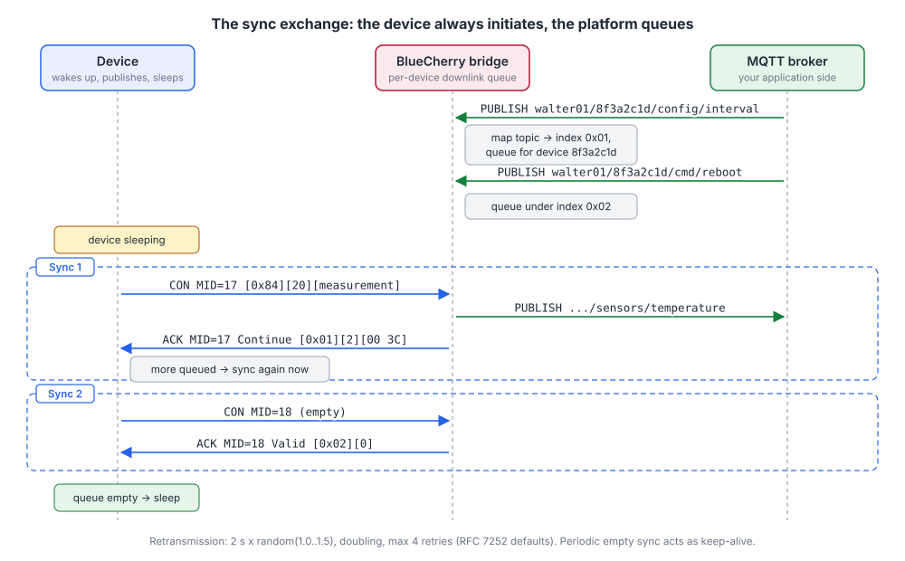
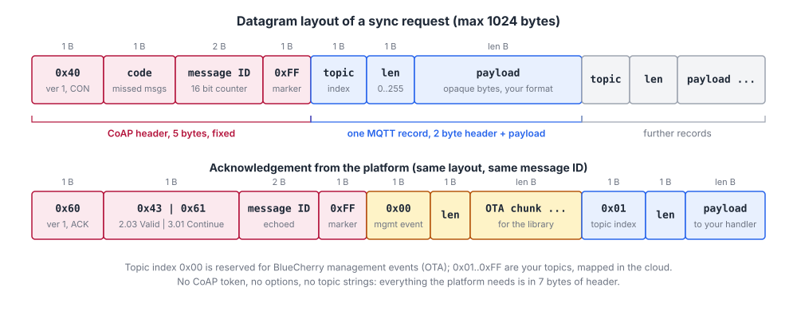
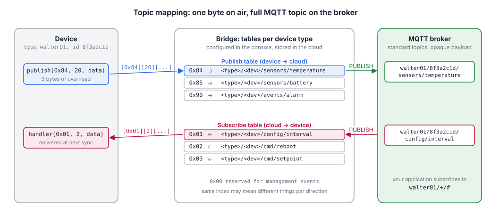
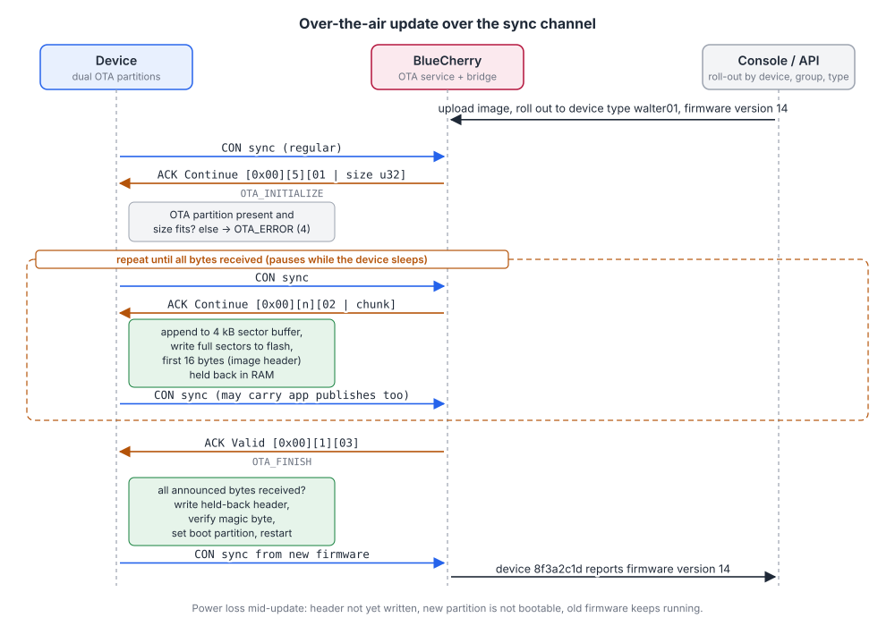
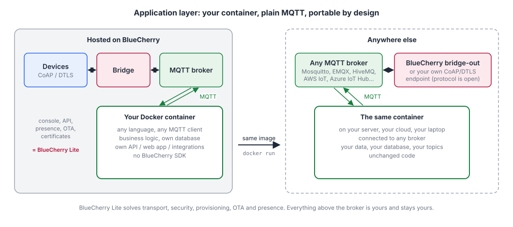

# BlueCherry Lite

*BlueCherry Lite* is the part of BlueCherry that manages and connects devices via a lightweight protocol while offloading parts of the IoT stack to the cloud. The main goal is to get data from a device to your application and back, and keep the fleet manageable (provisioning, certificates, firmware updates), in a way that is efficient and secure on every kind of network. The same firmware and the same protocol work on a broadband link such as WiFi or Ethernet and on a narrowband, high latency link such as NB-IoT, LTE-M or NB-IoT over satellite (NTN).

This page describes how BlueCherry Lite works under the hood. It is written for firmware and backend engineers who want to understand what happens on the wire, what the security model is, and how the application side can be built without tying yourself to BlueCherry.



## Purpose and design goals

Most IoT platforms are built around MQTT over TLS over TCP. That works fine on WiFi and Ethernet, but it is a poor match for constrained cellular networks. TCP needs a three-way handshake, keeps state that gets dropped by carrier NATs after a few minutes of silence, and every reconnect costs a full TLS handshake of several kilobytes. On NB-IoT, where a radio transaction can take seconds and every byte is paid for in energy and airtime, this quickly dominates the power budget of a battery powered device. Even worse, the latency added by NB-IoT coverage enhancement repetitions can exceed TCP's retransmission timeout, which drops connections in weak-coverage or indoor installations. 

BlueCherry Lite was designed with the following goals:

- **One protocol for every network.** A device that talks to BlueCherry over WiFi during development talks exactly the same way over NB-IoT in the field. There is no separate "lightweight" mode to test.
- **Minimal bytes on air.** The transport is UDP based (CoAP over DTLS), the security session survives sleep and NAT rebinding, and topics are compressed to a single byte. A typical sensor message costs well under 100 bytes including all headers.
- **Security by default.** Every device has its own private key and X.509 certificate. The device authenticates the platform and the platform authenticates the device (mutual authentication). There are no shared secrets or API tokens in firmware.
- **Complete device management.** Provisioning (in production or zero-touch in the field), certificate life cycle, online status, and over-the-air firmware updates are all part of the platform, not something the application developer has to build.
- **No lock-in on the application side.** Everything that leaves the device layer is plain, standard MQTT. Your business logic runs as your own container against a standard broker or on your own infrastructure.

BlueCherry Lite is deliberately not a rules engine, dashboard builder or time series database. Those belong to the application layer, which is yours to choose. 

## Transport: CoAP over DTLS

### Why CoAP and DTLS

All communication between a device and BlueCherry runs over a single UDP socket to `coap.bluecherry.io`, port `5684`, using CoAP ([RFC 7252](https://www.rfc-editor.org/rfc/rfc7252)) secured with DTLS. Compared to MQTT over TLS/TCP this brings:

- no TCP connection setup or teardown, so no three-way handshake and no FIN/RST traffic;
- a message oriented model that maps naturally onto a device that wakes up, exchanges a few datagrams and goes back to sleep;
- retransmission and acknowledgement handled at the application layer with timers that suit high latency links;
- a security layer (DTLS) that does not depend on the IP address and port staying the same.

### DTLS versions, cipher suites and keys

BlueCherry Lite uses DTLS 1.2 ([RFC 6347](https://www.rfc-editor.org/rfc/rfc6347)) with the Connection ID extension ([RFC 9146](https://www.rfc-editor.org/rfc/rfc9146)) and session resumption, and DTLS 1.3 ([RFC 9147](https://www.rfc-editor.org/rfc/rfc9147)) where the device stack supports it.

Key exchange is elliptic curve Diffie-Hellman (ECDHE) on the NIST P-256 curve (`secp256r1`). Device and server certificates are ECDSA P-256 certificates signed with SHA-256, issued by BlueCherry's own private CA (a root plus an intermediate). The device firmware ships with this chain to verify the server, and the platform uses it to verify device certificates, whether they were issued during production or through ZTP. Elliptic curve cryptography was chosen over RSA because a P-256 certificate is roughly a quarter of the size of a comparable RSA certificate, which matters during the handshake, and because signing and key agreement are fast enough on a Cortex-M or ESP32 class microcontroller.

### Mutual certificate authentication

Every device holds its own private key and an X.509 certificate issued by the BlueCherry CA. The certificate subject is `C=BE, CN=<type_id>.<device_id>`, so the identity of the device is bound to its key and can be verified cryptographically by the platform on every handshake. Conversely the device only accepts a server that presents a certificate chaining up to the BlueCherry root CA and matching the hostname `coap.bluecherry.io`.

This means:

- a device cannot impersonate another device, even if it knows the other device's ID;
- a captured device reveals only its own key, which can be revoked from the platform;
- there is no fleet-wide password or API key that could leak;
- the platform knows exactly which device it is talking to before a single byte of application data is exchanged.

### Session ID and Connection ID: one handshake, long lived session

The DTLS handshake is the most expensive part of the whole communication. With mutual certificate authentication it takes several flights and a few kilobytes in each direction. BlueCherry Lite is built so that a device does this as rarely as possible, ideally once per power cycle.



Two mechanisms are used:

**Connection ID (CID).** In classic DTLS the server identifies a session by the 5-tuple (source IP, source port, destination IP, destination port, protocol). When a cellular device sleeps, the carrier NAT forgets the mapping and the next datagram arrives from a different public IP or port. Without CID the server cannot find the security context and the device is forced into a new handshake. With the Connection ID extension, each DTLS record carries a small identifier negotiated during the handshake, and the server uses that identifier instead of the address to look up the session. The device can sleep for hours, change IP address, or roam between cells, and simply continue sending encrypted records. This is the single biggest bandwidth saving on NB-IoT and NTN.

**Session ID and resumption.** If the device does lose its DTLS state, for example after a deep sleep where RAM is not retained, it can resume the previous session instead of running a full handshake. In DTLS 1.2 this is done with the session ID (or a session ticket) from the previous handshake: the abbreviated handshake skips the certificate exchange and key agreement and only derives new keys. In DTLS 1.3 session IDs no longer exist; resumption is done with a pre-shared key delivered in a `NewSessionTicket` message after the first handshake, which gives a one round trip resumption and optionally 0-RTT data.

**DTLS 1.3 specifics.** Compared to DTLS 1.2, DTLS 1.3 is cheaper on constrained links for three reasons. The full handshake takes one round trip less (the `HelloVerifyRequest` cookie exchange of 1.2 is folded into `HelloRetryRequest`, and the server sends its certificate and finishes in the same flight). The record header is a compact variable-length "unified header" of two bytes plus the CID and a one or two byte sequence number, instead of the fixed 13 byte header of DTLS 1.2. And the CID mechanism is part of the core protocol (the extension is still negotiated with the same `connection_id` extension as in RFC 9146, but the record format and the CID update messages are built into the specification). Session resumption in 1.3 is PSK based as described above.

### What the device library does on reconnect

The reference implementation (the `bluecherry` library for ESP-IDF, Linux or Zephyr, LGPL licensed) keeps a state machine around the DTLS session. When a transmission fails or times out after all retransmissions, the library drops back to the `AWAIT_CONNECTION` state and reconnects with exponential backoff, starting at 100 ms and capped at 30 seconds. The socket, DTLS context and message counters are reset; the certificates, keys and configuration are kept.

Connection ID and session resumption are handled by the DTLS stack of the platform in use: on Walter the Sequans GM02SP modem terminates DTLS with CID support, and on the nRF91 family the Zephyr TLS stack does the same, so the application processor never re-runs a handshake after sleep or an IP change.

## Provisioning

A device needs a private key and a certificate before it can talk to BlueCherry. There are two ways to get them there.

### Provisioning during production

When you control the production line, the device generates its own P-256 key pair during manufacturing and the private key never leaves the device: it is written straight into protected storage such as an encrypted NVS partition or a secure element. Only the public key, in the form of a certificate signing request, is exported from the production station and uploaded to the BlueCherry console or API in a secure environment. BlueCherry signs it and returns the device certificate, which is flashed alongside the key. The device then calls `bluecherry_init()` with the certificate and key.

This approach gives the platform a record of every unit before it ships and keeps the private key on the device at all times. It is the recommended route for high volume production and for products where you do not want any enrolment logic in the field.

### Zero Touch Provisioning (ZTP)

With ZTP the device leaves the factory without any BlueCherry specific credentials. Only the **type ID** of the device type is compiled into the firmware. On first boot the device generates its own key pair, proves who it is with hardware identifiers, and receives a certificate from the platform. The private key never leaves the device.



The flow, as implemented in `bluecherry_init_ztp()`:

1. The application supplies a small storage callback (the "BIO handler") that can read and write a certificate and a key, for example in secure NVS. If both are present the device is already provisioned and skips to step 8.
2. The device opens a DTLS session to the ZTP endpoint `coap.bluecherry.io:5688`. This session authenticates the **server only**; the device has no certificate yet.
3. The device sends a CoAP `POST /v1/devid` with a CBOR payload: an array of the type ID followed by a map of identification parameters. Supported parameters are the MAC address (6 bytes), the IMEI of the cellular modem (15 digits, encoded as a 64 bit integer) and an out-of-band challenge (64 bit).
4. The platform checks that the type ID exists and allows ZTP, checks the identifiers against the rules configured for that device type (for example an allow-list of IMEIs uploaded by the manufacturer, or a MAC OUI range), and allocates a **device ID**. The device ID is returned as a CBOR text string. Type IDs and device IDs are both 8 characters.
5. The device generates a fresh P-256 key pair using the hardware random number generator and builds a certificate signing request (CSR) with subject `C=BE, CN=<type_id>.<device_id>`, signed with SHA-256.
6. The device sends the DER encoded CSR as a CBOR byte string in a CoAP `POST /v1/sign`.
7. The platform's CA signs the CSR and returns the DER certificate as a CBOR byte string. The device converts it to PEM and hands both certificate and key to the BIO handler for permanent storage.
8. The device closes the ZTP session and connects to the production endpoint `coap.bluecherry.io:5684` with full mutual authentication.

The identifiers a device presents are checked against the identifiers registered for it on the platform. You decide which identifiers a device type requires and you can register as many as you want per device: MAC, IMEI, an out-of-band challenge, or any combination. The ZTP endpoint only issues a certificate when all registered identifiers match, when the device has been placed in the correct state for enrolment, and only once; after a certificate has been issued for a device the enrolment is closed and the platform will not issue another one for the same identifiers. Because the CSR is generated on the device, BlueCherry never sees the private key.

MAC addresses and IMEIs are identifiers rather than secrets, so for deployments where a device could be impersonated before it is installed, register additional identifiers or add the out-of-band challenge described below.

### Out-of-band authentication

For devices that have a user interface, or that are installed by a technician, the identifier check can be strengthened with an out-of-band (OOB) challenge. The device shows a code (for instance a PIN on a display, or a QR code) or the installer reads a code printed on the label, and enters it in the BlueCherry console or in your own app which forwards it via the API. The device includes the same 64 bit challenge value in its `/v1/devid` request. The platform only issues a device ID when the challenge matches an entry that was confirmed out-of-band, which ties a physical device to an account or installation without any secret in firmware.

## The sync exchange

Once provisioned, all traffic between device and platform is a series of **sync exchanges**. Each sync is one CoAP confirmable request from the device and one acknowledgement from the platform. The device is always the initiator; the platform never sends unsolicited datagrams. This is what makes the protocol work behind carrier NATs and with sleeping devices: the platform queues everything for the device and hands it over the next time the device syncs.



### Frame layout

The library adds a fixed 5 byte CoAP header and a 2 byte record header per message. The CoAP header is deliberately minimal: no token, no options. Instead the 8 bit CoAP code field of the request is used to carry the number of messages the device sent since the last acknowledgement it received, so the platform can detect lost datagrams.



| Field | Size | Value |
|---|---|---|
| CoAP header byte | 1 | `0x40`: version 1, type CON, token length 0 |
| Code | 1 | number of unacknowledged messages before this one (0 in normal operation) |
| Message ID | 2 | incrementing 16 bit counter, wraps from 65535 to 1 |
| Payload marker | 1 | `0xFF` |
| Records | 0..n | one or more `[topic index (1 byte)] [length (1 byte)] [payload]` |

The maximum size of a complete datagram is 1024 bytes, which leaves 1017 bytes for a single publish payload. In practice applications on NB-IoT keep messages well below that so that a datagram fits in one radio transaction.

The response from the platform is a CoAP acknowledgement with the same message ID. Its code tells the device whether there is more to fetch:

| Response code | Meaning |
|---|---|
| `2.03 Valid` (`0x43`) | Sync complete, the platform's queue for this device is empty. |
| `3.01 Continue` (`0x61`, BlueCherry specific) | Sync accepted, but more messages are queued. Sync again immediately. |

The payload of the acknowledgement uses the same record format. Records with topic index `0x01`..`0xFF` are MQTT messages for the application, delivered to the message handler. Records with topic index `0x00` are **management events** for the BlueCherry library itself (see OTA below); the application never sees them.

### Reliability

CoAP confirmable messaging provides the reliability. The device waits for the acknowledgement with a timeout of 2 seconds multiplied by a random factor between 1.0 and 1.5, doubles the timeout on each retry, and gives up after 4 retransmissions (the RFC 7252 defaults). Because every request carries a message ID and the acknowledgement echoes it, the device can distinguish a delayed acknowledgement from a lost one. The "missed messages" count in the code field lets the platform log when datagrams from a device went missing.

Application payloads are queued in RAM on the device until they are acknowledged. A message is only removed from the outgoing queue after the platform has acknowledged the CoAP request that carried it. If the device loses connectivity, the queue is preserved across reconnects (but not across a reset, unless the application persists it).

### Sync cadence

The application decides when to sync, which is what gives control over the power budget:

- **Event driven.** Calling `bluecherry_publish()` enqueues a message; the next `bluecherry_sync()` sends it. With `auto_sync` enabled the library's background task sends immediately.
- **Periodic empty sync.** If nothing is queued, the library sends an empty sync every `CONFIG_BLUECHERRY_AUTO_SYNC_SEC` seconds. This acts as the keep-alive, lets the platform know the device is alive, and gives the platform the opportunity to deliver queued downlink messages and OTA data. On a battery device this interval is typically minutes to hours; on a mains powered WiFi device it can be a few seconds.
- **On wake-up.** A deep sleeping device typically syncs once after each wake-up: it publishes its measurements and receives whatever the platform queued for it in one round trip.

Because the platform never pushes, downlink latency equals the sync interval. We are currently working on an upgrade where the platform can also push messages to the device if the underlying transport allows this (private APN, long lived NAT, ...). 

## Topic mapping: one byte instead of a string

Standard MQTT topics are UTF-8 strings such as `walter01/8f3a2c1d/sensors/temperature`. Sending that string with every message would cost more bytes than the measurement itself. BlueCherry Lite therefore never puts topic strings on the air. Instead the device works with **topic indexes**, a single byte from `0x01` to `0xFF` (`0x00` is reserved for management events).



The mapping from index to full MQTT topic is configured in the BlueCherry BlueApp admin console per **device type** and is stored in the cloud, not in the device. Every mapping expands to a topic of the form:

```
<type_id>/<device_id>/<suffix you choose>
```

where the platform fills in the type ID and device ID of the device that sent or receives the message, and the suffix is free text defined by you. Two independent tables exist per device type:

- **Publish table (device to cloud).** When the device publishes on index `0x84`, the bridge looks up `0x84` in the publish table of that device type, for example `sensors/temperature`, and publishes the payload as a standard MQTT message on `walter01/8f3a2c1d/sensors/temperature`.
- **Subscribe table (cloud to device).** For every device the bridge subscribes to the expanded subscribe topics of its type, for example `walter01/8f3a2c1d/config/interval` for index `0x01`. When your application publishes there, the bridge queues the payload under index `0x01` for that device and delivers it at the next sync.

Because the tables are separate, index `0x01` can mean one thing in the uplink and another in the downlink. The same firmware works for every device of a type, and you can add topics later by adding an index in the console and handling it in the firmware; nothing in the protocol needs to change.

The payload itself is opaque to BlueCherry. Most customers use compact binary structures or CBOR on constrained links and JSON on WiFi devices, but any byte string of up to 1017 bytes is accepted and delivered unchanged to the MQTT side.

### Bytes on air, indicative

For a 20 byte binary measurement, using AES-128-CCM-8 and a 4 byte Connection ID, a BlueCherry Lite publish costs roughly:

| Layer | Bytes |
|---|---|
| Record header (topic index + length) | 2 |
| CoAP header + payload marker | 5 |
| DTLS 1.2 record header + CID + inner content type + explicit nonce + tag | 13 + 4 + 1 + 8 + 8 = 34 |
| UDP + IPv4 | 28 |
| **Total for a 20 byte payload** | **about 89 bytes** |

plus a short acknowledgement in the other direction. The same message over MQTT with a 35 character topic on TLS 1.2 over TCP is in the order of 150 bytes for the publish alone, before TCP acknowledgements, MQTT keep-alives, and the TCP and TLS handshakes that a NAT timeout forces on a sleeping device. With DTLS 1.3 the record overhead shrinks further because of the unified header. These numbers are indicative; the exact figures depend on cipher suite, CID length and IP version.

## Over-the-air firmware updates

OTA in BlueCherry Lite reuses the sync channel. There is no separate download server, no HTTP client on the device and no additional TLS session: firmware chunks arrive as management events (topic index `0x00`) in the acknowledgements of ordinary syncs. This means an OTA works on any network the device can sync on, including NB-IoT, and that the update transparently pauses when the device sleeps and resumes when it syncs again.



### Flow

1. You upload a firmware image for a device type in the console and roll it out to one device, a group, or the whole type. BlueCherry verifies the image and marks the selected devices as pending.
2. On the device's next sync the platform answers with a management event `OTA_INITIALIZE` (event type `1`) containing the total image size as a 32 bit integer, and with response code `Continue`.
3. The device checks that an OTA partition is available and large enough. If not, it queues an `OTA_ERROR` event for the platform and ignores the update.
4. The device syncs again immediately (it received `Continue`). Each acknowledgement now carries one or more `OTA_CHUNK` events (event type `2`) with a slice of the image. The device appends the chunk to a 4 kB sector buffer and writes complete sectors to flash, erasing blocks as it goes.
5. This repeats until the announced size has been received. The chunk size is chosen by the platform so that a chunk fits comfortably in one datagram on the device's network.
6. The platform sends `OTA_FINISH` (event type `3`). The device verifies that exactly the announced number of bytes was written and that the image header is valid, marks the new partition as the boot partition, and restarts into the new firmware.
7. After reboot the new firmware syncs as usual, and the platform records the new version for the device.

### Safety measures

- **The partial image can never boot.** The first 16 bytes of the image (the header with the magic byte) are held back in RAM and only written to flash after the last chunk has been verified. A power loss halfway through an update leaves the new partition unbootable and the old firmware intact.
- **Size and bounds checks.** A chunk that would exceed the announced size, an empty chunk, or an announced size larger than the partition all abort the update and report an error event.
- **Standard dual partition layout.** On targets that support it, like ESP32 and nRF91, the library uses A/B-partitioning so the platform's rollback and anti-rollback features (secure boot, version checks) can be used unchanged.
- **Encrypted transport.** Chunks travel inside the mutually authenticated DTLS session; there is no separate download URL that could be intercepted or replayed.

### Modem firmware

For Walter based devices BlueCherry can also deliver Sequans GM02SP modem firmware. The same chunked mechanism is used; the library hands the image to the modem's own update path instead of to the ESP32-S3 flash.

## Device management

Beyond moving data, BlueCherry Lite provides the day-to-day fleet operations that every deployment needs:

- **Device types and devices.** Devices are grouped by type, which defines the topic tables, the firmware images, the ZTP rules and the OTA chunk size. Individual devices carry their certificate, last-seen time, firmware version and free metadata.
- **Certificate life cycle.** Certificates can be revoked per device (for example for a lost or returned unit). Revocation takes effect immediately: the platform terminates the device's active DTLS session, drops any further messages from that certificate and refuses new handshakes with it. Re-provisioning a device is a matter of clearing its stored credentials and letting ZTP run again, or issuing a new certificate from the production flow.
- **Firmware management.** Images are versioned per device type. Roll-outs can target a single device for testing, a group, or the full fleet, and progress is visible per device.
- **Presence and monitoring.** Every sync updates the device's last-seen timestamp. Expected intervals can be configured per type so that silent devices show up.
- **White-label console.** The BlueCherry console can be branded for your own customers, or you can drive everything through the REST API and build your own.

## Running the application layer without lock-in

BlueCherry Lite intentionally stops at the MQTT broker. Everything that makes your product yours, the business logic, data storage, dashboards and integrations, runs in the **application layer**, and BlueCherry is designed so that layer never depends on anything BlueCherry specific.



### Bring your own container

The recommended way to run your application is as a **Docker container hosted on BlueCherry**. You build a container in any language and framework you like (Node.js, Python, Go, Java, .NET, Rust, it does not matter), and it connects to the BlueCherry MQTT broker with a standard MQTT client using the credentials the platform provides. Your container subscribes to the topics of your devices, processes the data, stores it in whatever database you choose, exposes your own API or web app, and publishes back to the devices by publishing on their subscribe topics.

BlueCherry runs the container next to the broker, keeps it running, gives it persistent storage and exposes it behind its single-sign-on infrastructure and device authentication security.

The broker is shared, but tenants are strictly isolated. Every device type has its own broker credentials, and those credentials can only publish and subscribe within the topic space of that type (`<type_id>/...`). A container can therefore never see or inject traffic for another customer's devices, and the same rule applies to any external MQTT client you connect.

### Why this is not lock-in

Because the interface between BlueCherry and your container is plain MQTT, the container has no dependency on BlueCherry itself:

- **Portable code.** The same image can run on your own server, in any cloud, or on a laptop, connected to any MQTT broker. Nothing in it imports a BlueCherry SDK.
- **Standard protocol.** MQTT is an open ISO/OASIS standard with clients for every language. Topic strings are yours; payload formats are yours.
- **Your data stays yours.** Your container owns its database. BlueCherry does not need to store application data at all; it only buffers messages for devices that are asleep.
- **Documented device protocol and open source client.** The device side protocol is described on this page, and the reference device library is published under the LGPL. If you ever decide to run the device layer yourself, you know exactly what a compatible CoAP/DTLS endpoint and bridge need to do.
- **Bridging out.** If you prefer to run the application layer elsewhere, your topics can be bridged to your own infrastructure, and your container simply moves with it.

The result is a clear division: BlueCherry Lite handles the part that is hard and repetitive on constrained networks (transport, security, provisioning, OTA, presence), and your application handles the part that differentiates your product, with an exit path that stays open.