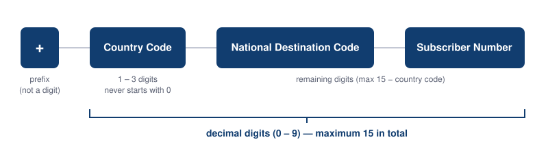

# Notifications

## Introduction

BlueCherry devices can send notifications to users. The timing and content of these notifications
is fully determined at the application level. The role of the platform is to facilitate the
application in sending these notifications. Currently the platform supports the following types of
notifications, uniquely identified by their number:

 1. Email messages, both with and without attachments
 2. SMS messages
 3. Phone calls with a text-to-speech engine
 4. Push notifications to the BlueCherry smartphone app or your own application

Unique to the notification system of BlueCherry is that the recipient is not required to be linked
to the sending device or even have an account on the platform. This makes the system very flexible
in terms of who you can reach.

## Email

Email messages are an easy way to communicate with users in an asynchronous way and they can
contain quite a lot of information. In BlueCherry an email message is always constructed as a
MIME multipart message and it has the following parameters:
  * **type**: 1
  * **destination**: the email address to send the email to.
  * **subject**: the subject of the email.
  * **plain**: the body of the email formatted as plain text.
  * **html**: the body of the email formatted as HTML.
  * **file** *(optional)*: a file to attach to the email.

Email messages are free to send but they are rate-limited in order to prevent misuse. If the
platform detects improper use the device will be automatically blocked.

## SMS

SMS messages are sometimes perceived as higher priority than email or push notifications, and they
also work when the user's handset has no data connection but only a 'GSM' connection. An SMS has
the following parameters:
  * **type**: 2
  * **destination**: the phone number of the recipient in [E.164 format](#e164-phone-numbers).
  * **message**: the body of the message, if this is longer than 160 characters the message will be
    split over multiple messages.

SMS messages are a metered consumable and there must be enough credits available to the device
before it can send messages. We recommend keeping SMS messages under 160 characters as this will
keep your costs down and also ensure a faster delivery to the handset of the recipient.

## Phone call

For very high priority messages a phone call is typically your best option. BlueCherry uses a
classifier model (AI if you like) to detect in which language the body is written. The language
determines the text-to-speech voice that the platform selects. This way the platform does its best
to achieve the best possible pronunciation. A phone call has the following parameters:
  * **type**: 3
  * **destination**: the phone number of the recipient in [E.164 format](#e164-phone-numbers).
  * **message**: the body of the message, the computer voice will say this to the recipient.

Phone calls are a metered consumable and there must be enough credits available to the device
before it can make phone calls.

## Push notification

Push notifications are received by a smartphone application which is connected to the BlueCherry
platform. This can be the unbranded BlueCherry app for [Android](https://play.google.com/store/apps/details?id=com.dptechnics.bluecherry.bluecherry) or [iOS](https://apps.apple.com/us/app/bluecherry/id1128671681) or a custom application that implements the BlueCherry push notification API. Push
messages have the following parameters:
  * **type**: 4
  * **destination**: the email address of the BlueCherry account to which you want to send the push
    notification or any of the BlueCherry placeholders:
    * `BLUECHERRY_DESTINATION_OWNER`: the owner of the device
    * `BLUECHERRY_DESTINATION_SHARED_USERS`: all shared users of the device
    * `BLUECHERRY_DESTINATION_OWNER_AND_SHARED_USERS`: the owner and the shared users of the device
    * `BLUECHERRY_DESTINATION_INVITED_USERS`: the invited users of the device
  * **title**: the title of the push notification.
  * **message**: the body of the push notification.
  * **auto_open** *(optional)*: false by default but when set to true the app will automatically
    open the interface of the device when the user clicks on the notification.
  * **app_data** *(optional)*: data that a custom application can process. This allows
    customizations such as custom sounds based on the type of notification.

Push notifications are a metered consumable and there must be enough credits available to the
device before it can send push notifications.

## E.164 phone numbers

For [SMS messages](#sms) and [phone calls](#phone-call) it's required to format the destination
number in the [E.164 format](https://www.itu.int/rec/T-REC-E.164-202602-I/en). This format is well
defined and must:
  * Start with a '+'-sign
  * Consist only of digits after the '+'-sign
  * Have a maximum length of 15 digits
  * Not add a leading '0' to the [country code](https://en.wikipedia.org/wiki/List_of_telephone_country_codes)

Country codes have a length between one and three digits. The *National Destination Code* is
sometimes better known as the *Area Code* and together with the *Subscriber Number* it forms the
phone number that recipients usually know by heart.