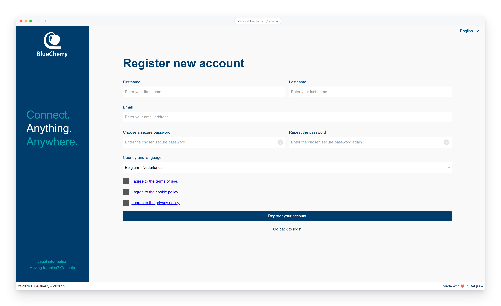
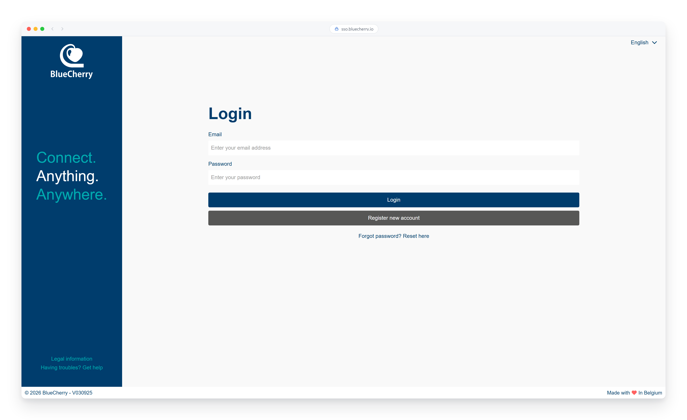
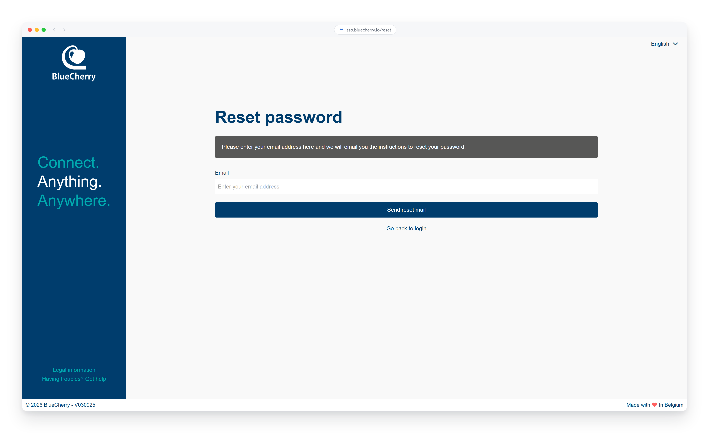

# Register & Login

This guide will show you how you can use the BlueCherry single sign on service which is used to
register a new account and to login with your existing account.

## Register

In order to get started with the platform you must register your user account. To do this you can
browse to [sso.bluecherry.io/register](https://sso.bluecherry.io/register). The information that we
request on this page is solely used to authenticate and greet you, we highly value the privacy of
our users.

As soon as your details are filled in you can click the "Register your account" button after which
you will receive a confirmation email. Please click the confirmation link in this email in order to
activate your account, only then will you be able to log in to the platform.

## Login

Logging in to the BlueCherry platform works via a *Single Sign On* principle. Go to the
[sso.bluecherry.io](https://sso.bluecherry.io/) page and fill in your username and password. Now
click the "Login" button to proceed. In case the login fails it can have the following reasons:
 - Your password is not correct. If you think you might have forgotten your password you can follow
   the [reset password](#reset-password) section in order to set a new password.
 - Your account is not yet active and you need to click the activation link in the email that you
   received before you can log in.
 - The account you are trying to use is non-existent.

For security reasons the platform will not tell you why the login attempt failed. This prevents an
unauthorized user from checking whether a given email address exists in our database.

## Reset password

Click the "Forgot password? Reset here" button on the login page or go directly to the
[password reset](https://sso.bluecherry.io/reset) page. Fill in the email that you used to register
your account. If, and only if, your email address is known to the platform you will receive an email
with instructions that you can follow to choose a new password. In order to protect the privacy of
our users the platform will not give an error if the email address is not known.

